# Iceland
Inspired by Death Stranding, I've been expecting to visit Iceland for a long time. At the end of 2024, I finally made it. The trip was amazing, and I was so lucky to see the northern lights bursting. I've taken a lot of photos, and here are some of them.

## Aurora
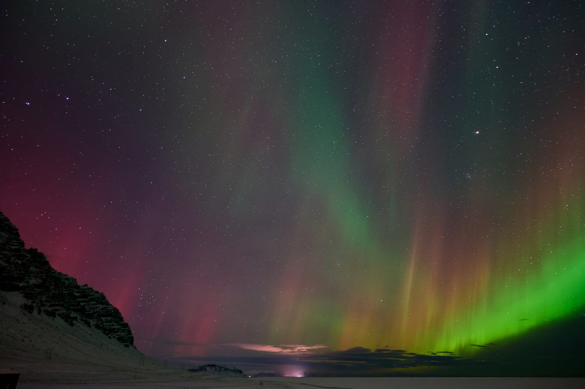
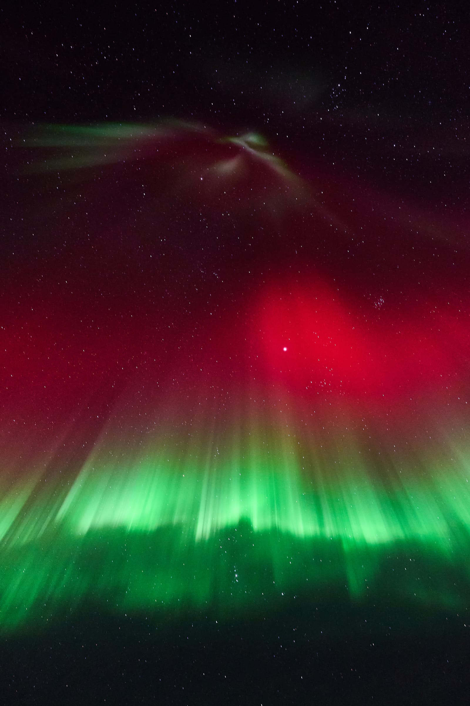
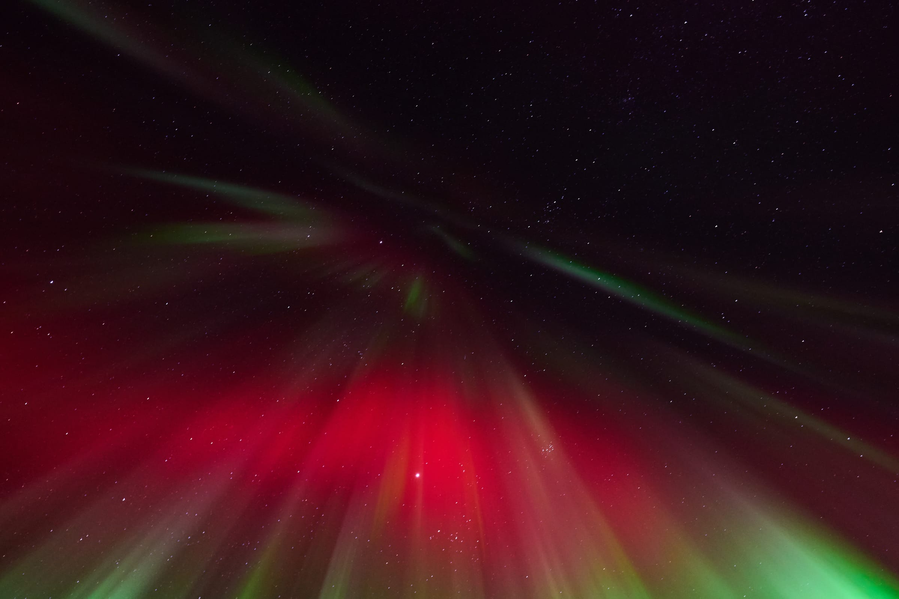

## Diamond Beach 
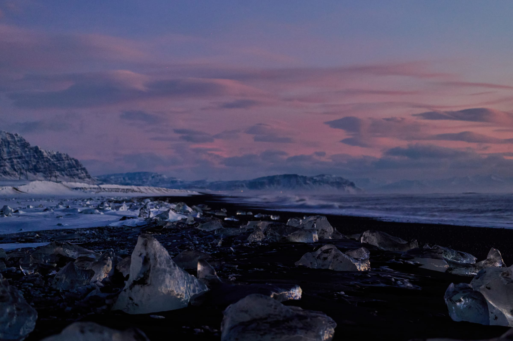

## Rekjavik
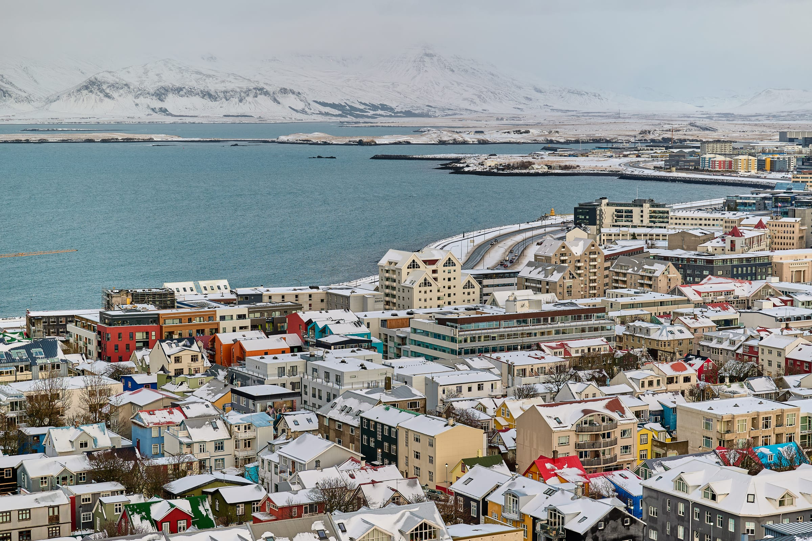
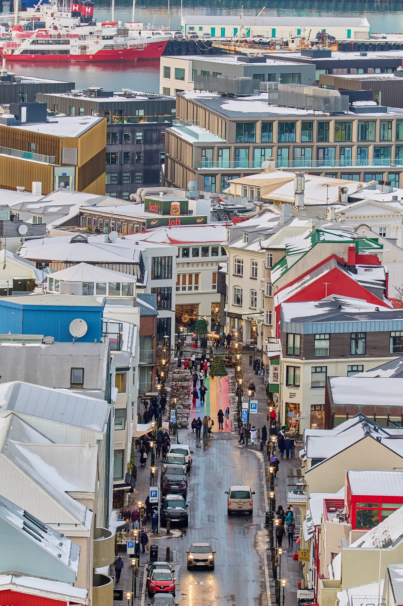

## Vic Town
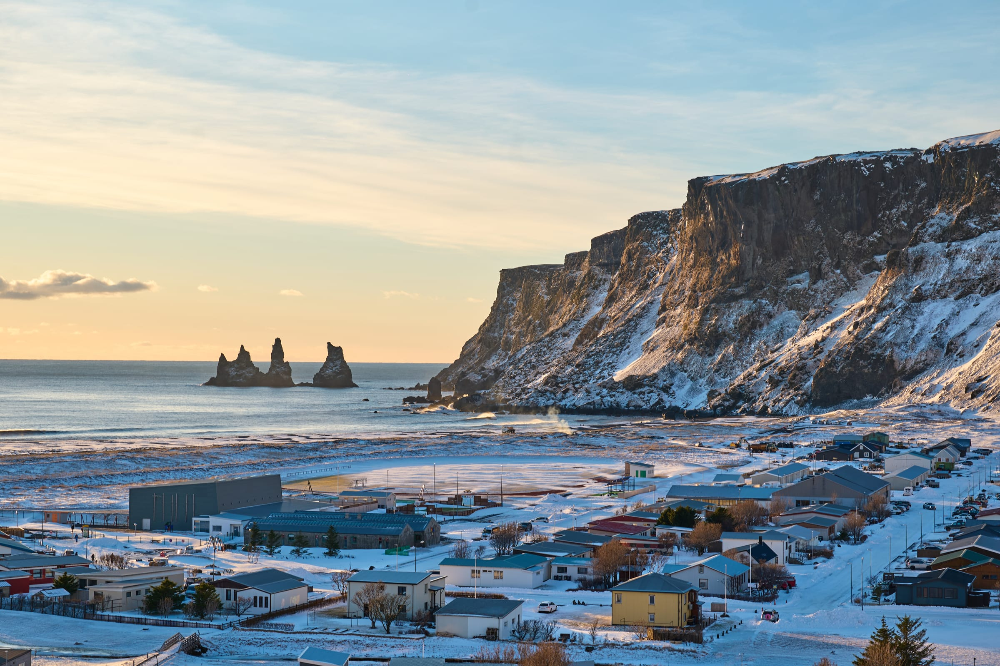
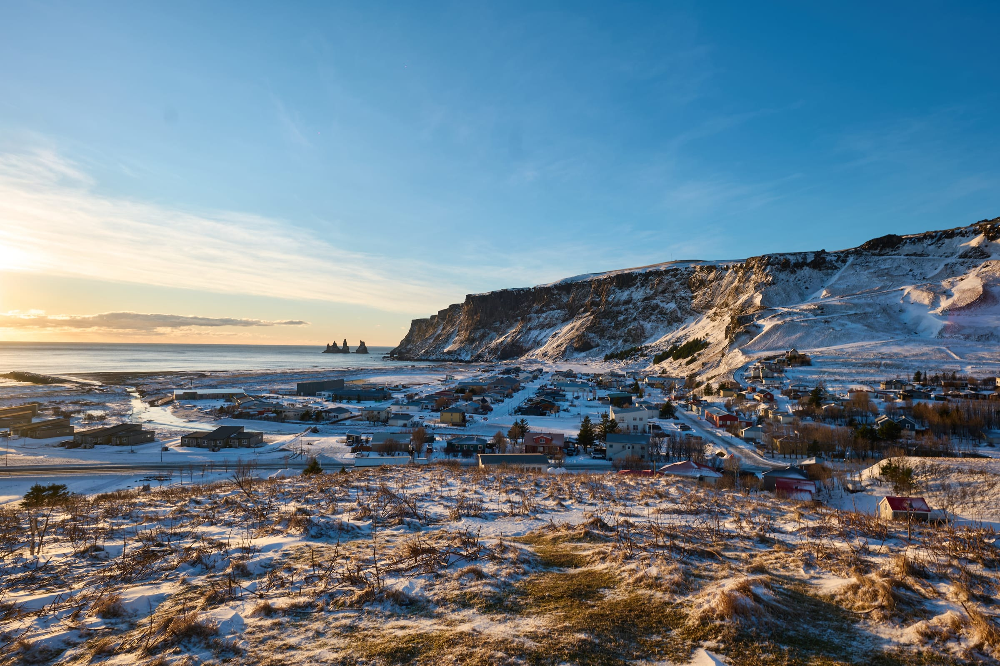

## Roadsides
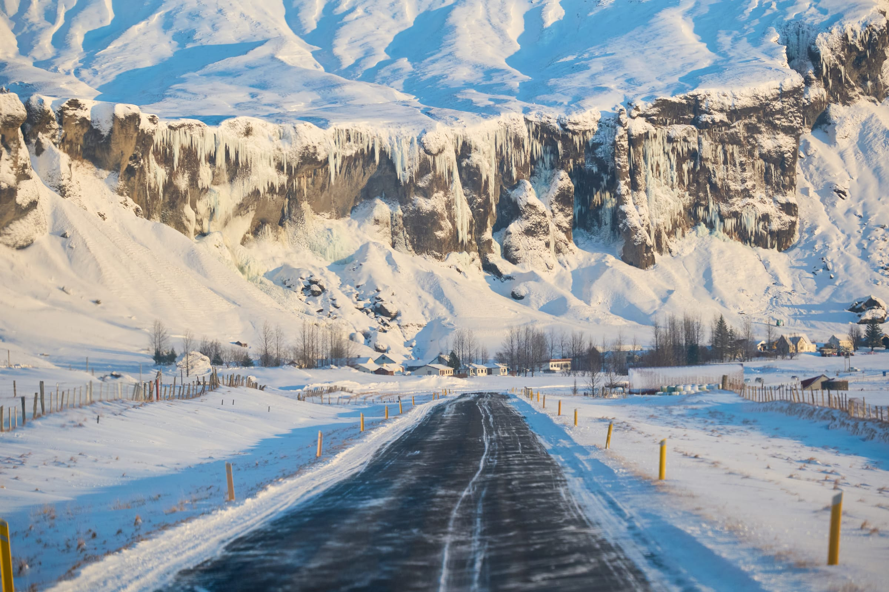
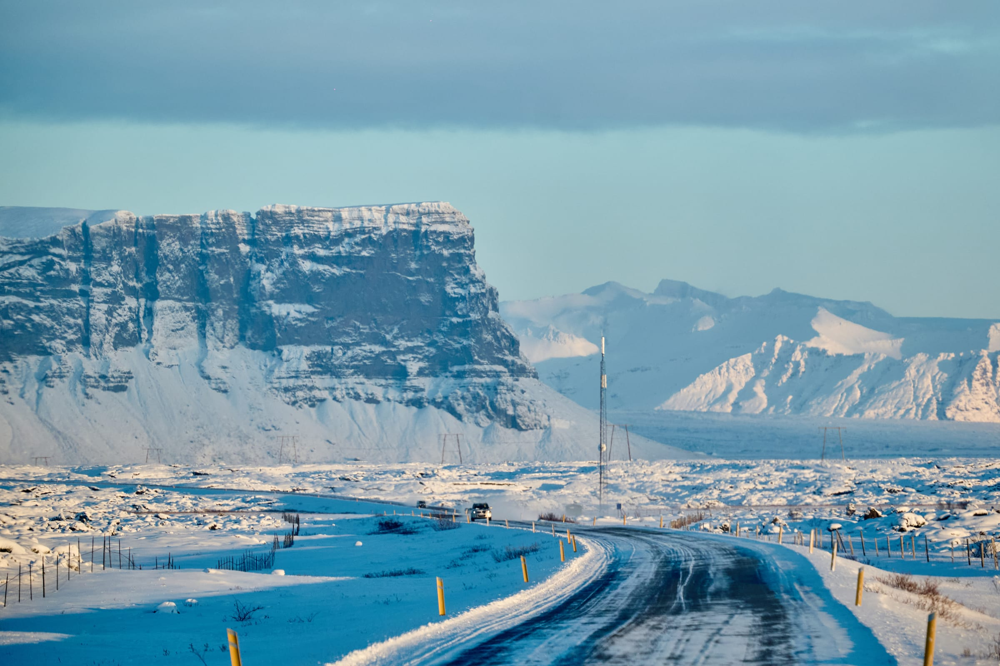
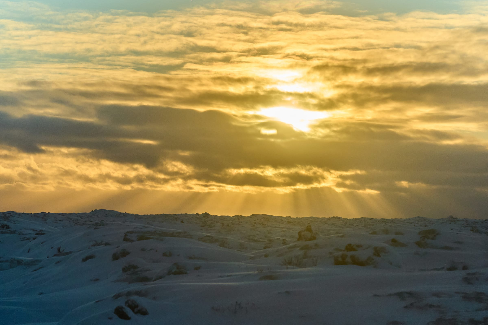

## Waterfall/river
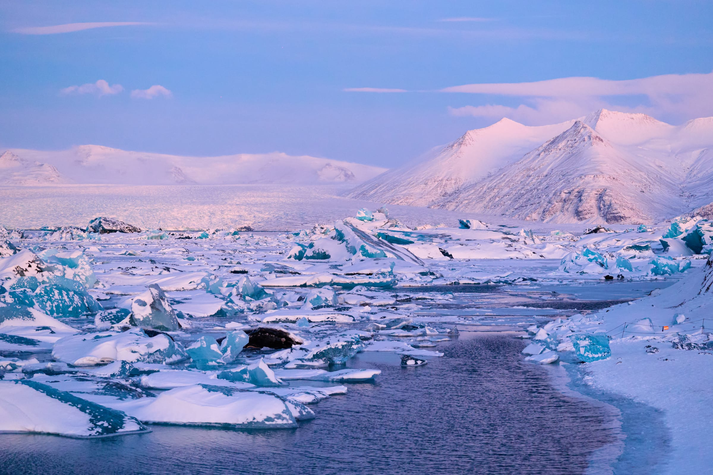
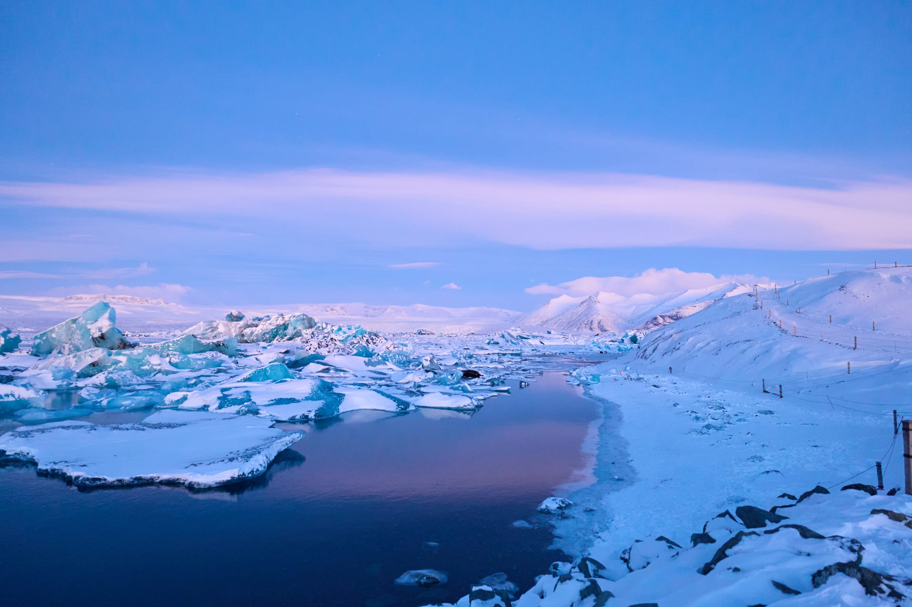
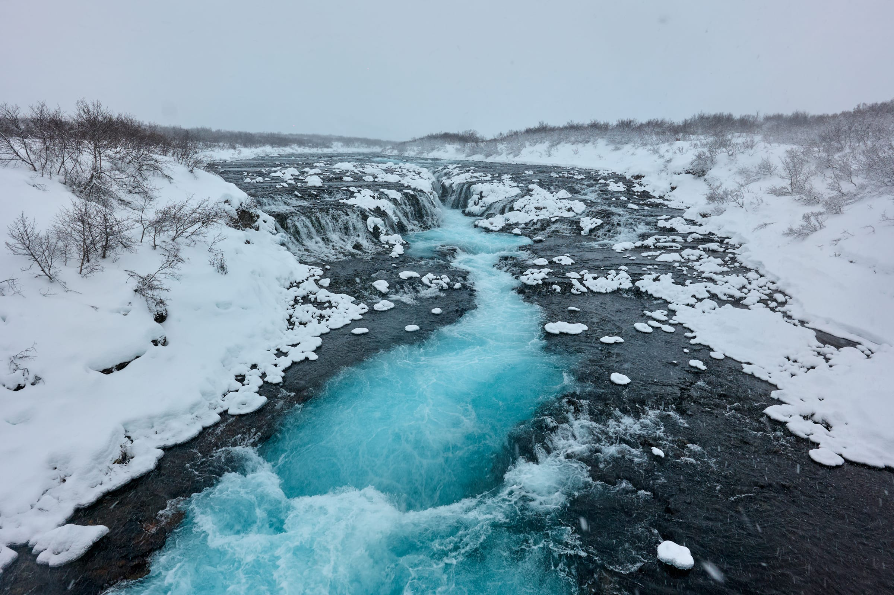

## Gyser
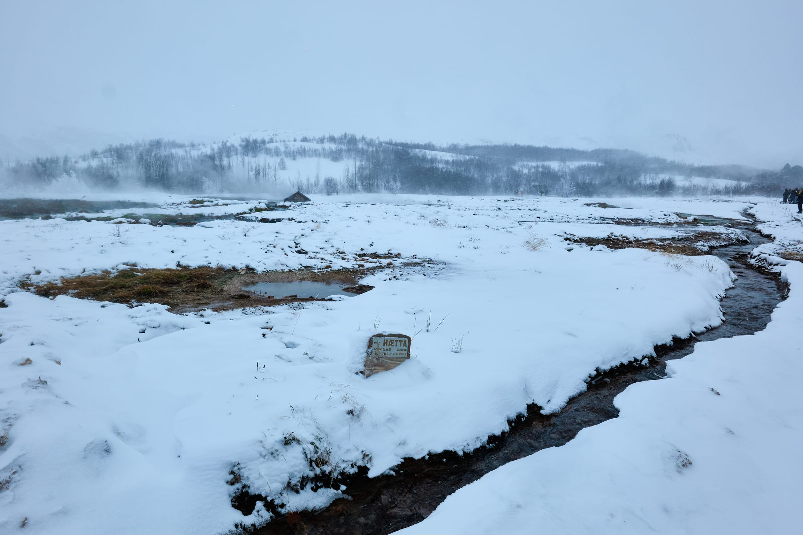
