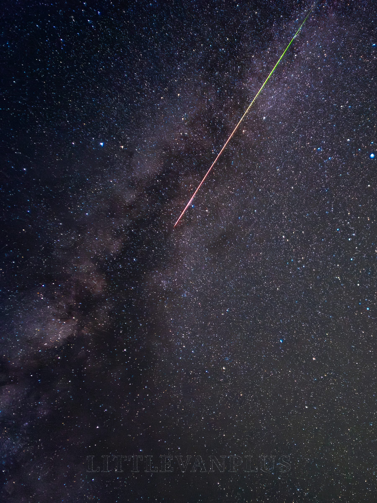
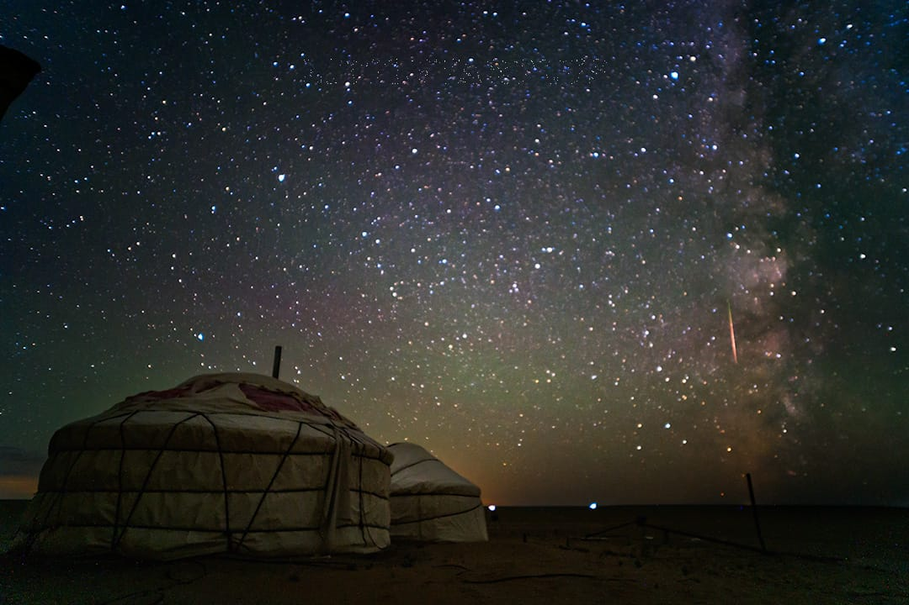
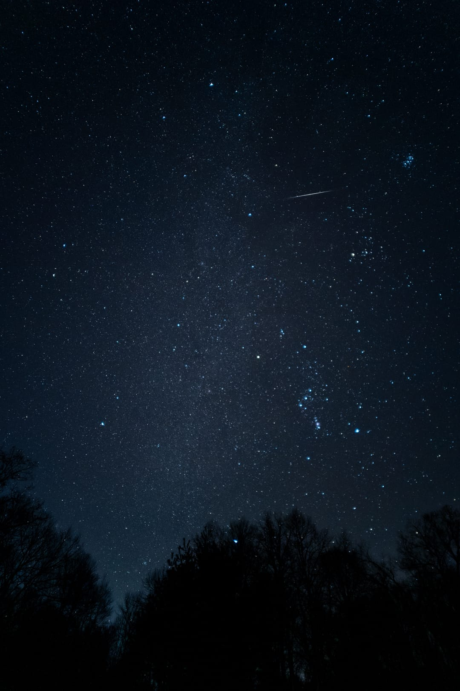
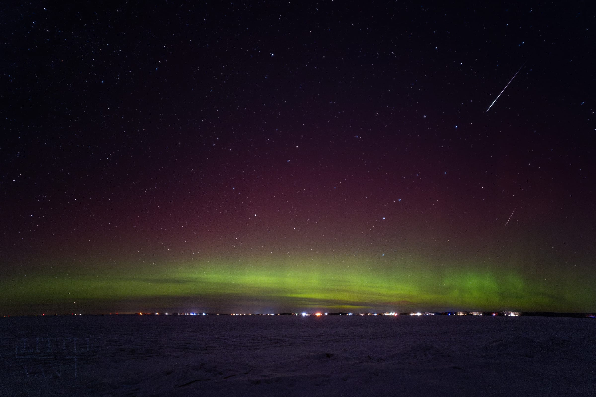
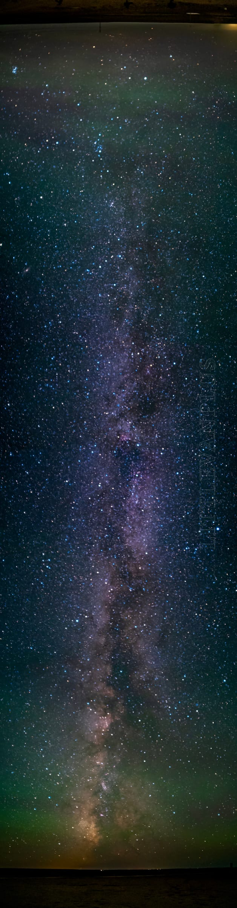

# Galaxy
I love the galaxy, the stars, the planets, and the aurora.  \ 
I love the feeling of being in the universe, and I love the feeling of being so small in the universe.\ 
Enjoy:)
## Meteor

## Aurora
You can also see 2 meteors in the photo.

## Milky Way

