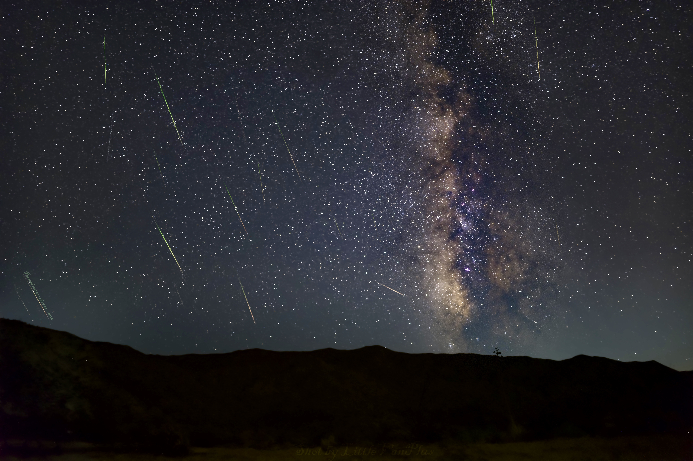
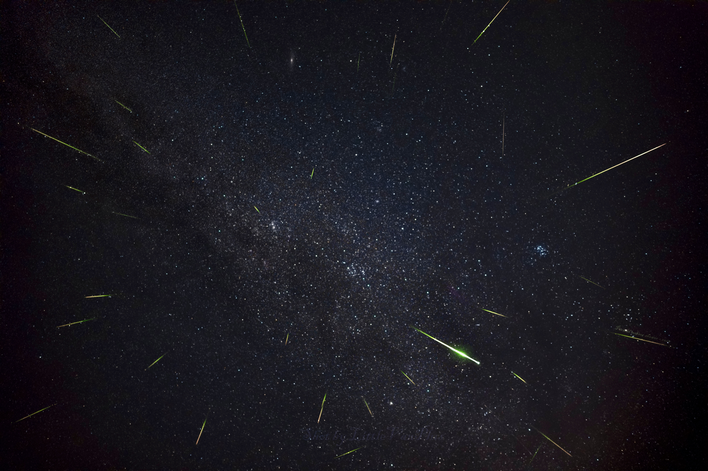
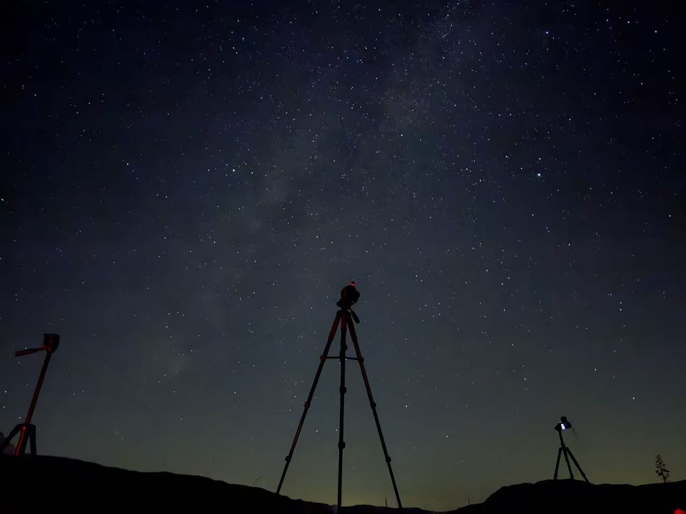

# Perseid Meteor Shower, Aug 12

Drove out to Anza-Borrego Desert State Park for the peak night of the Perseids. Some of the darkest skies in Southern California — the Milky Way was obvious to the naked eye, and meteors kept streaking overhead all night.

The first shot is a stack of the meteors I caught, with the galactic core rising over the desert ridgeline.

